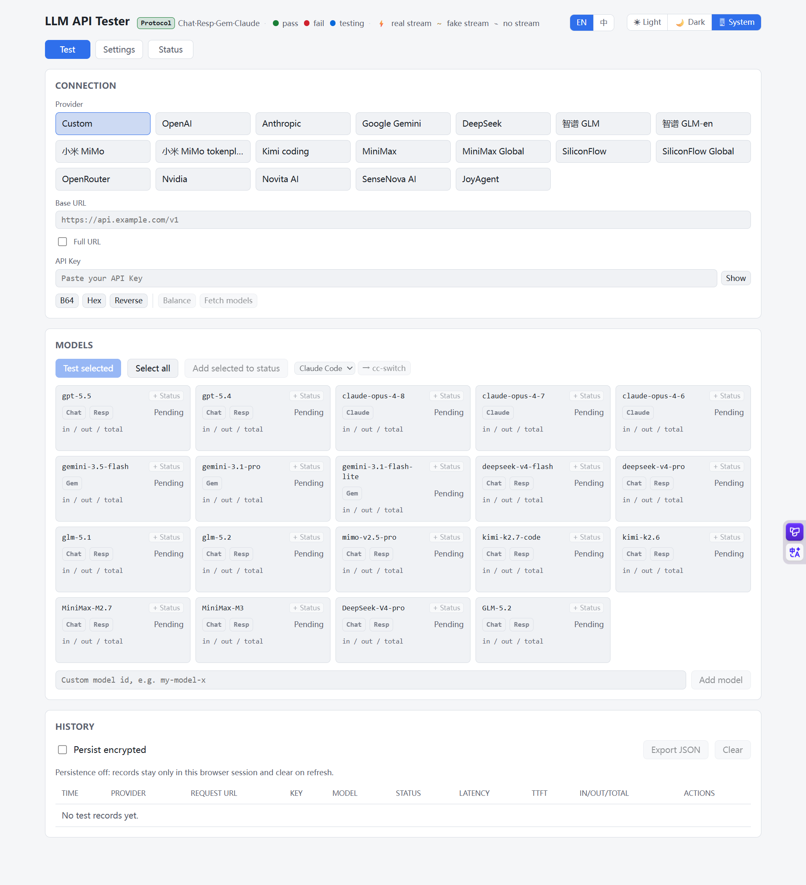

# ModelPing · LLM API 测试工具

[English](./README.md) | **简体中文**

开箱即用的轻量 Web 工具，用于快速点测各家大模型 API 是否可用，并测量延迟与 token 消耗。



支持的协议：

| 协议               | 端点                                          | 典型供应商                                                       |
| ------------------ | --------------------------------------------- | ---------------------------------------------------------------- |
| `openai-chat`      | `/chat/completions`                           | OpenAI、DeepSeek、GLM、Qwen、Kimi、小米、各类聚合商…（多数兼容） |
| `openai-responses` | `/responses`                                  | OpenAI Responses API                                             |
| `gemini`           | `:generateContent` / `:streamGenerateContent` | Google Gemini 原生                                               |
| `anthropic`        | `/v1/messages`                                | Anthropic Claude                                                 |

特性：

- 选供应商自动填入 baseUrl；每个模型会按供应商自动探测合适协议
- 自动探测非流式与流式（SSE）可用性
- **查询余额**：按 baseUrl 主机识别供应商，一键查可用余额/额度（DeepSeek、SiliconFlow、OpenRouter、StepFun、Novita 等）
- **拉取模型列表**：从供应商 `/models` 端点拉取可用模型，弹层搜索多选后批量加入测试表格
- **一键导入 cc-switch**：把当前 provider 或已通过测试的 provider + model 导入到 Claude Code、Codex、Gemini CLI、OpenCode、OpenClaw
- 可选自定义 User-Agent 预设，用于按客户端 UA 放行的 coding-plan 上游；模型测试、流式检测、模型列表和余额查询会一致生效
- 返回总延迟、首字延迟（TTFT，流式）、输入/输出/总 token
- 模型表格逐行状态灯：灰待测 → 蓝测试中 → 绿通过 / 红失败
- 批量测试（默认并发 2）、自定义模型、可调超时/重试/maxTokens/输入文本
- 历史记录（可持久化开关、复制 baseUrl/掩码 key、导出 JSON）
- 状态页：保存常用 provider + model，批量刷新端点延迟，支持自动刷新与 cc-switch 导入
- **密钥安全**：后端不明文存储、不打印任何 API Key；启用私有工作态时仅以加密 blob 保存

## 快速开始（本地）

```bash
npm install
npm run dev      # 前端 5173（开发） + 后端 8787，浏览器开 http://localhost:5173
```

生产模式（单进程，前后端同源）：

```bash
npm run build
npm start        # http://localhost:8787
```

## 供应商辅助功能

在连接面板填好供应商 `baseUrl` 和 API Key 后，ModelPing 还可以帮你完成几件常见配置工作：

- **查询余额**：点击 API Key 输入框旁边的「余额」。后端会按 `baseUrl` 的 host 匹配供应商，调用对应余额端点；支持的供应商会返回剩余余额/额度，不支持的会明确提示不支持。
- **拉取模型**：点击「拉模型」。ModelPing 会调用供应商 `/models` 端点，弹出可搜索、多选的模型列表，确认后批量加入测试表格。
- **一键导入 cc-switch**：模型区的「→ cc-switch」可导入当前 provider；历史记录中测试成功的行也会出现同样按钮，可连同已验证的 model 一起导入。按钮左侧下拉可选择目标应用：Claude Code、Codex、Gemini CLI、OpenCode、OpenClaw，随后会唤起本机 `ccswitch://v1/import` 深链。

这些辅助功能复用 UI 中配置的 `baseUrl`、API Key、完整 URL 模式和可选 User-Agent。API Key 只会在本次请求/深链导入动作中使用，后端不会持久化保存。

## 默认模型

预设里内置了一批默认模型与精选 provider，参考 `farion1231/cc-switch` 的 provider/baseUrl/model 预设维护：

- 官方/原生：OpenAI、Anthropic、Google Gemini
- 国内与编码计划：DeepSeek、智谱 GLM、通义千问 Qwen、Moonshot/Kimi、Kimi For Coding、小米 MiMo、火山 Ark 
- 聚合与全球平台：SiliconFlow、OpenRouter、Nvidia

默认模型包含 `gpt-5.5` / `gpt-5.4`、`claude-opus-4-8` / `claude-sonnet-4-6`、`gemini-3.5-flash` / `gemini-3.1-pro`、`deepseek-v4-flash` / `deepseek-v4-pro`、`glm-5.2`、`kimi-k2.7-code`、`mimo-v2.5-pro` 等。

> ⚠️ 各家 model id 随官方持续演进。预设值仅供起步，请对照官方文档核对；UI「设置」里可增删改供应商和模型（保存在本机浏览器），也可以直接编辑 `web/public/presets.json` 后重新构建/部署作为新的默认配置。

## 参数默认值

| 参数           | 默认                                    |
| -------------- | --------------------------------------- |
| 输入文本       | 你好，请用一句话自我介绍。              |
| 传输           | 自动探测非流式与流式                    |
| 超时           | 30000 ms                                |
| 最大重试       | 1（指数退避，仅网络/超时/429/5xx 重试） |
| 最大输出 token | 512                                     |
| 并发数         | 2                                       |
| User-Agent     | 空（不覆盖运行时默认 UA）               |

## 部署

低成本个人公网部署推荐走 Cloudflare Workers。应用会部署成 Worker API + Workers Static Assets，普通页面和静态资源由 Assets 托管，只有 `/api/*` 会进入 Worker。

### Docker（自托管 / 云服务器）

仓库仍保留 GitHub Actions 工作流（`.github/workflows/docker-publish.yml`）作为自托管回退。它只在手动触发或推送 `v*` tag 时构建并推送 GHCR 镜像，日常 `main` push 可交给 Cloudflare Builds 自动部署。

一次性配置：

1. **公开镜像** —— 手动运行 workflow 或推送 `v*` tag 后会发布 `ghcr.io/<owner>/modelping`。到仓库 *Packages* 把可见性设为 **Public**，服务器才能免登录拉取。（fork 的话，把 `docker-compose.yml` 里的 `image:` 改成你自己的 `ghcr.io/<owner>/modelping`。）
2. **在服务器上**：
   ```bash
   git clone https://github.com/<owner>/ModelPing.git
   cd ModelPing
   cp .env.example .env        # 设置 APP_PASSWORD 和 PRIVATE_STATE_SECRET（不入库）
   docker compose up -d        # http://<server>:8787
   ```

`docker-compose.yml` 跑两个服务：`modelping`（应用）和 `watchtower`（每 5 分钟检查 GHCR，拉新镜像、重启、清理旧镜像）。镜像不烘焙任何 key。

之后更新可手动重新运行 workflow 或推送 `v*` tag，Watchtower 会在一个间隔内自动重新部署。想在机器上本地构建而不走 GHCR？把 `image:` 换回 `build: .`，用 `docker compose up -d --build`。

环境变量（写在 `.env`，或 `docker-compose.yml` 的 `environment:` 块）：

- `APP_PASSWORD`（compose 要求必填）：`/api` 的访问口令闸
- `PRIVATE_STATE_SECRET`（compose 要求必填）：私有工作态的长随机加密密钥；建议与 `APP_PASSWORD` 分开
- `ALLOWED_HOSTS`：可选，逗号分隔的目标主机白名单（防开放代理 / SSRF）。留空则允许任意自定义目标主机；若留空，请改在网络层阻断内网访问（见安全说明）
- `CORS_ORIGIN`：逗号分隔的允许跨站来源（缺省同源，见下方安全说明）

设置持久化（presets 跨设备共享）默认用 file 驱动，`docker-compose.yml` 已把 `SETTINGS_FILE` 指到 `/data/presets.json` 并挂了命名卷 `presets-data`，重建容器不丢失。首次卷为空时 `/presets.json` 会自动回退到镜像内置的默认预设。

私有工作态（历史记录、历史持久化开关、上次连接、测试参数、状态页条目，含 API Key）在存在 `PRIVATE_STATE_SECRET`、`STATUS_SECRET` 或 `APP_PASSWORD` 时，会以加密 blob 形式存到后端。Docker 建议单独设置 `PRIVATE_STATE_SECRET`，这样更换访问口令不会导致已有状态无法解密。`STATUS_SECRET` 仅作为旧版本兼容 fallback；旧版 localStorage 敏感键会被迁移一次并删除；主题、语言和非敏感 presets 缓存仍保留在本机。

### Cloudflare Workers（免费版）

```bash
npx wrangler login
npx wrangler kv namespace create SETTINGS_KV
npm run deploy:cf
npx wrangler secret put APP_PASSWORD
npx wrangler secret put PRIVATE_STATE_SECRET
```

把返回的 KV id 填进 `wrangler.toml`：

```toml
[[kv_namespaces]]
binding = "SETTINGS_KV"
id = "<your-kv-namespace-id>"
```

静态资源经 `[assets]` 托管，SPA 路由自动回退 index.html。`wrangler.toml` 已启用 `assets_navigation_prefers_asset_serving`，浏览器刷新前端路由会走 Assets，不消耗 Worker 请求；只有 `/api/*` 调用 Worker。

免费版默认策略偏保守：

- `PRIVATE_STATE_SCOPE=config`：KV 保存 presets、上次连接、测试参数和状态页条目，不保存测试历史。
- `BLOCK_PRIVATE_HOSTS=1`：Workers 没有 Docker 版出站防火墙，公网部署默认启用应用层私网地址拦截。
- `APP_PASSWORD` 和 `PRIVATE_STATE_SECRET` 必须用 Workers secret，不写进 `wrangler.toml`。

要实现 GitHub push 自动部署，在 Cloudflare Workers Builds 连接本仓库：

- Production branch：`main`
- Build command：`npm run build:cf`
- Deploy command：`npx wrangler deploy`

Cloudflare 免费版参考额度：Workers Free 为 100,000 请求/天、10ms CPU/请求、50 个 subrequests/请求；KV Free 为 100,000 读/天、1,000 写/天、同一 key 1 写/秒、1GB 存储；Workers Static Assets 请求免费且不限量。

### Vercel（免费版）

```bash
npm i -g vercel
vercel            # 首次按提示关联项目，后续 vercel --prod
```

前端静态托管 + 单个 serverless function（`api/index.ts`，由 `vercel.json` 把 `/api/*` 路由过去）。设置/私有工作态持久化默认走 Vercel Blob：在项目里接入 Blob 后会自动注入 `BLOB_READ_WRITE_TOKEN`，store 据此启用 vercel 驱动；未接入则关闭服务端持久化，UI 尽量降级。

> ⚠️ Vercel 免费版 serverless function 执行时长约 10s 上限，而本工具默认 `timeoutMs=30000`。测较慢的模型或长流式响应可能被平台中途切断，表现为非预期失败。建议私用、调小超时，或在 `vercel.json` 配置更高的 `maxDuration`（需对应套餐支持）。

### 设置持久化（presets 跨设备共享）

UI「设置」里增删改的供应商/模型默认存浏览器本地。若想跨设备共享，可启用服务端 presets 持久化（**presets 永不包含 apiKey**），按部署平台自动选驱动：

| 驱动       | 触发条件                              | 存储位置                          |
| ---------- | ------------------------------------- | --------------------------------- |
| `file`     | 默认（Node 自托管 / Docker）          | `./web/public/presets.json`，与 `/presets.json` 同源，改即生效 |
| `cf-kv`    | 绑定了 `SETTINGS_KV`                  | Cloudflare KV                     |
| `vercel`   | 存在 `BLOB_READ_WRITE_TOKEN`          | Vercel Blob                       |
| `none`     | `STORAGE_DRIVER=none`                 | 关闭服务端持久化（纯前端本地）    |

可用 `STORAGE_DRIVER` 显式指定驱动，`SETTINGS_FILE` 覆盖 file 驱动路径。

## 环境变量

| 变量                   | 作用                                                         |
| ---------------------- | ------------------------------------------------------------ |
| `APP_PASSWORD`         | 可选访问口令；设置后所有 `/api` 请求须带 `x-app-password`     |
| `ALLOWED_HOSTS`        | 可选目标主机白名单（逗号分隔），防开放代理 / SSRF；缺省不限制 |
| `BLOCK_PRIVATE_HOSTS`  | 设为 `1` 时拒绝目标解析到私有/环回/链路本地/云元数据地址（应用层 SSRF 兜底）；缺省关闭。需测试本地/内网端点（如 Ollama）时**勿开启** |
| `CORS_ORIGIN`          | 可选 CORS 允许来源（逗号分隔，`*` 表示全开）；缺省不下发 ACAO（默认同源） |
| `STORAGE_DRIVER`       | 显式选驱动：`file` / `cf-kv` / `vercel` / `none`             |
| `SETTINGS_FILE`        | file 驱动的 presets 路径，缺省 `./web/public/presets.json`   |
| `PRIVATE_STATE_SECRET` | 私有工作态加密密钥；全局可选，但内置 Docker compose 要求设置；缺省回退 `STATUS_SECRET`，再回退 `APP_PASSWORD` |
| `PRIVATE_STATE_SCOPE`  | 私有工作态持久化范围：`full`（默认）、`config`（仅连接/参数/状态，不保存历史）或 `none` |
| `PRIVATE_STATE_FILE`   | file 驱动的私有工作态密文路径，缺省 `./data/private-state.enc` |
| `STATUS_SECRET`        | 可选旧密钥兼容项；仅作为 private-state fallback             |
| `BLOB_READ_WRITE_TOKEN`| Vercel Blob token（接入 Blob 后自动注入）                    |
| `PORT`                 | Node 服务监听端口，缺省 8787                                 |

## 安全说明（重要）

- 本工具是一个**转发代理**：前端把 baseUrl + key 发给后端，后端转发给目标 API。
- 历史记录、上次连接和状态页条目中的 key 只保存在后端加密私有工作态中；若服务端不可用，则仅保留在当前浏览器会话内，不写入 localStorage。
- 旧版遗留的敏感 localStorage 键会在启动时迁移一次并删除，避免历史明文继续留在浏览器里。
- **CORS 默认同源**：未配置 `CORS_ORIGIN` 时后端不下发 `Access-Control-Allow-Origin`，其他网站的 JS 调不动你的 `/api`。需要跨站调用时才显式配置允许来源。
- 公网裸部署等于开放代理。务必设置强 `APP_PASSWORD`；Docker 用法还应放在 HTTPS 反代后面，并二选一：配置 `ALLOWED_HOSTS`，或运行内置 `deploy/firewall-egress.sh` 做网络层出站隔离。Cloudflare Workers 上除非明确要测私网地址，否则保持 `BLOCK_PRIVATE_HOSTS=1`。`APP_PASSWORD` 用常量时间比较，降低口令枚举风险。
- 通过非本机地址访问时，如果实例缺少访问口令或目标主机/私有地址限制，UI 会显示非阻塞安全提醒。
- 如果经常测试本地/内网端点，保持 `BLOCK_PRIVATE_HOSTS` 关闭，用 Docker 出站防火墙决定公网实例能访问哪些网段。不可信多租户环境可设 `BLOCK_PRIVATE_HOSTS=1` 作为应用层补充；它能拦截字面私有/环回/元数据 IP，但挡不住 DNS rebinding。
- 后端全程不打印 key 与请求体；失败日志里的 key/token/authorization 均做脱敏。

## 项目结构

```
src/
  types.ts            统一类型
  adapters/           4 个协议适配器 + 注册表（openai-chat / openai-responses / gemini / anthropic）
  runner.ts           fetch / 超时 / 重试 / SSE 解析 / usage 聚合 / 日志脱敏
  balance.ts          余额查询（按 host 匹配各家端点的可扩展注册表）
  models-fetch.ts     拉取供应商模型列表（按 baseUrl 形态选 /models 端点）
  presets-schema.ts   presets 校验（前后端共享的纯函数）
  app.ts              框架无关的 Hono app（校验 / 口令 / CORS / 白名单 / 路由 / 设置持久化）
  env.ts              Node / Workers / Vercel 共用的运行时 env/store 注入
  node.ts             Node 入口（@hono/node-server + 静态资源）
  worker.ts           Cloudflare Workers 入口（ASSETS 绑定）
  store/              设置持久化驱动：types / file / cf-kv / vercel / index（按平台自动选）
api/
  index.ts            Vercel serverless 入口
web/
  index.html  main.tsx  styles.css
  public/presets.json 默认供应商 / 模型 / 参数配置
  lib/                types / api(含 SSE) / storage / format / theme / presets / ccswitch
  components/         App / ConnectionPanel / ConfigPanel / ModelTable / ModelPickerModal /
                      HistoryPanel / SettingsPanel / ThemeToggle / CcSwitchButton / CopyButton
```

## 脚本

| 命令                | 作用                                      |
| ------------------- | ----------------------------------------- |
| `npm run dev`       | 开发（前端 + 后端热重载）                 |
| `npm run build`     | 构建前端(dist/client) + 后端(dist/server) |
| `npm run build:cf`  | 构建 Cloudflare Workers 静态资源          |
| `npm start`         | 运行已构建的 Node 服务                    |
| `npm run typecheck` | 类型检查                                  |
| `npm run deploy:cf` | 构建并部署到 Cloudflare                   |
| `vercel`            | 部署到 Vercel（`vercel --prod` 上生产）   |

## 开源声明

本项目以 [MIT 许可证](./LICENSE) 开源，可自由使用、修改、分发，详见根目录 `LICENSE` 文件。

默认模型与精选 provider 预设参考了 [farion1231/cc-switch](https://github.com/farion1231/cc-switch)（provider / baseUrl / model / 余额端点）。各家协议、模型 id 与端点归各自服务商所有，本工具仅作转发与测试，不附带任何 API Key，也不对第三方服务的可用性或计费负责。

欢迎提 issue 与 PR。提交前请确保 `npm run typecheck`、`npm test`、`npm run lint` 与 `npm run build` 通过。
